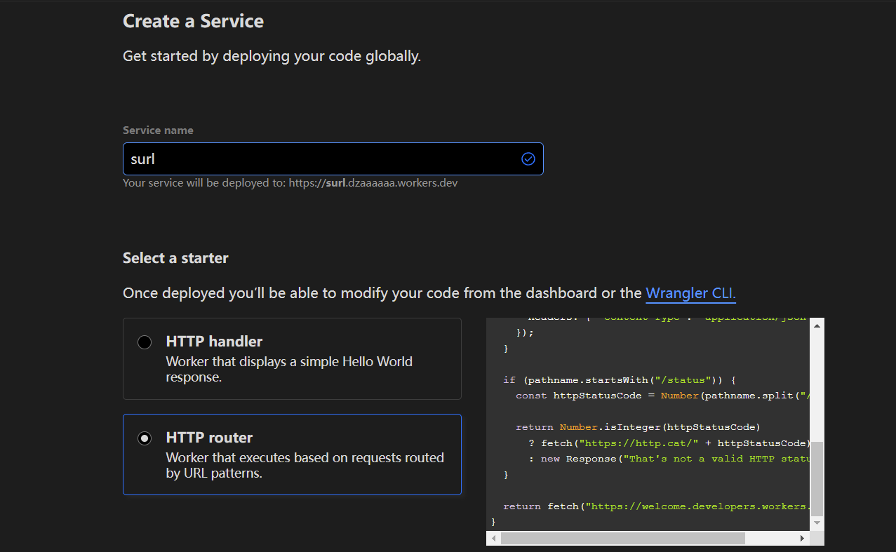
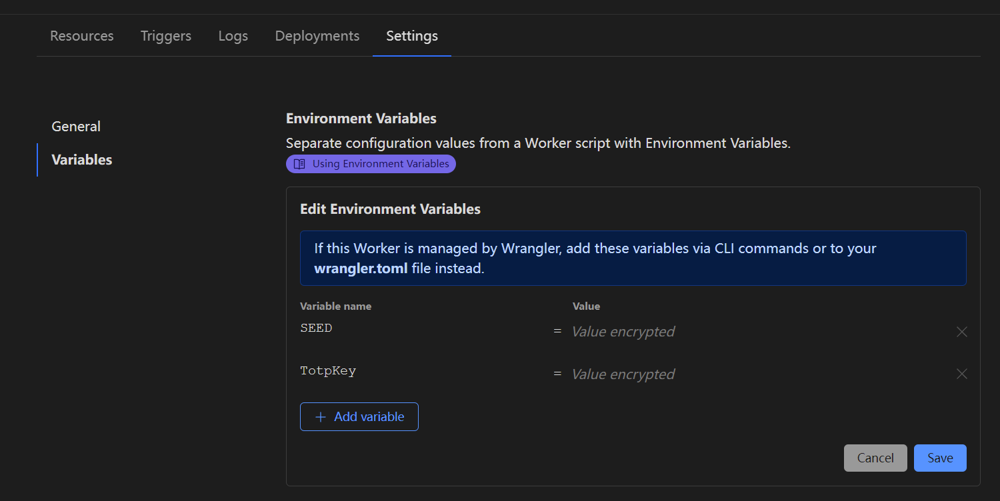
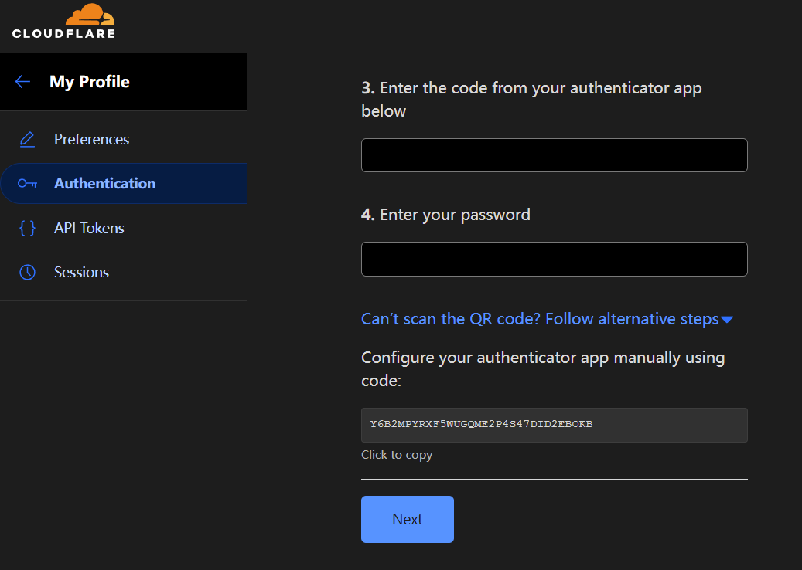
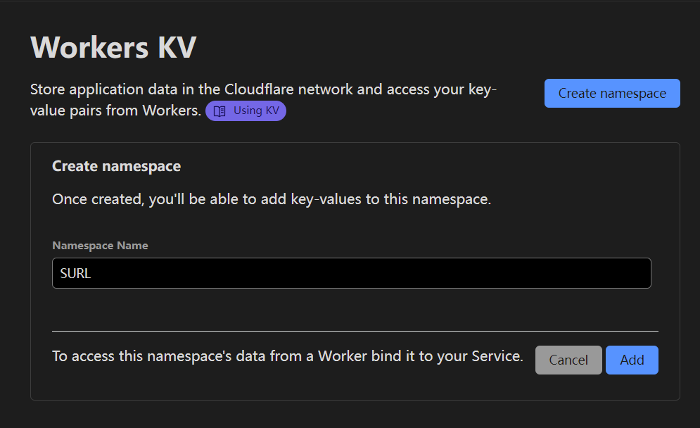

# SURL

Short URL (Workers KV)

# Deploy

1. Create a Service 
2. Copy the `COPY_THIS.js` to your Workers 
3. Add environment variable `SEED:number` `TotpKey:string` 
   suggest 
4. Create namespace
5. KV Namespace Bindings
6. Custom Domains

# API

### Request

```js
axios.post('/', {
    data: data,
    totpToken: totpToken
})
```

### Response

`/${token}` or `No permission`