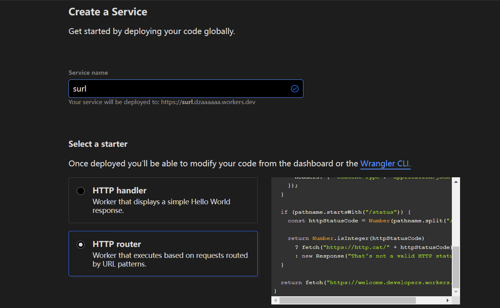
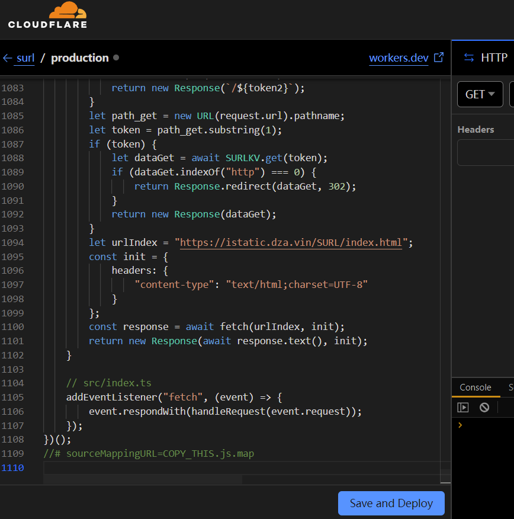
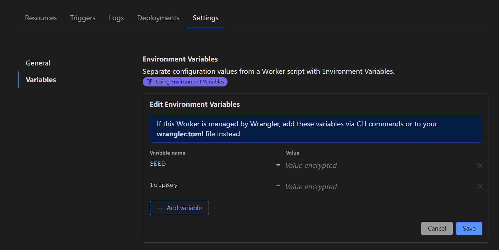
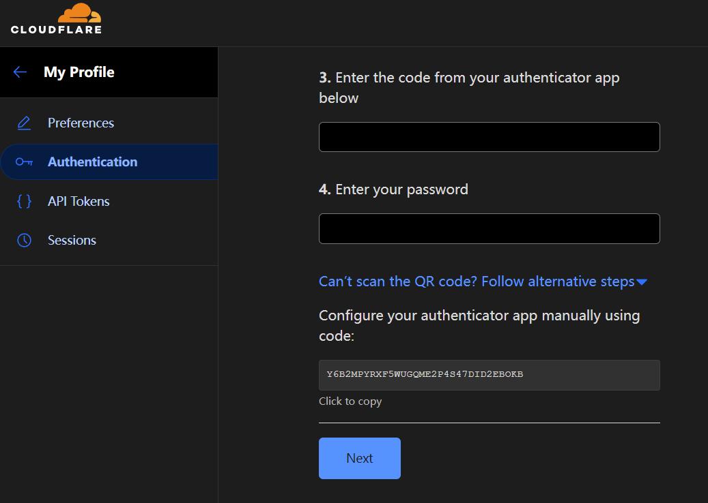
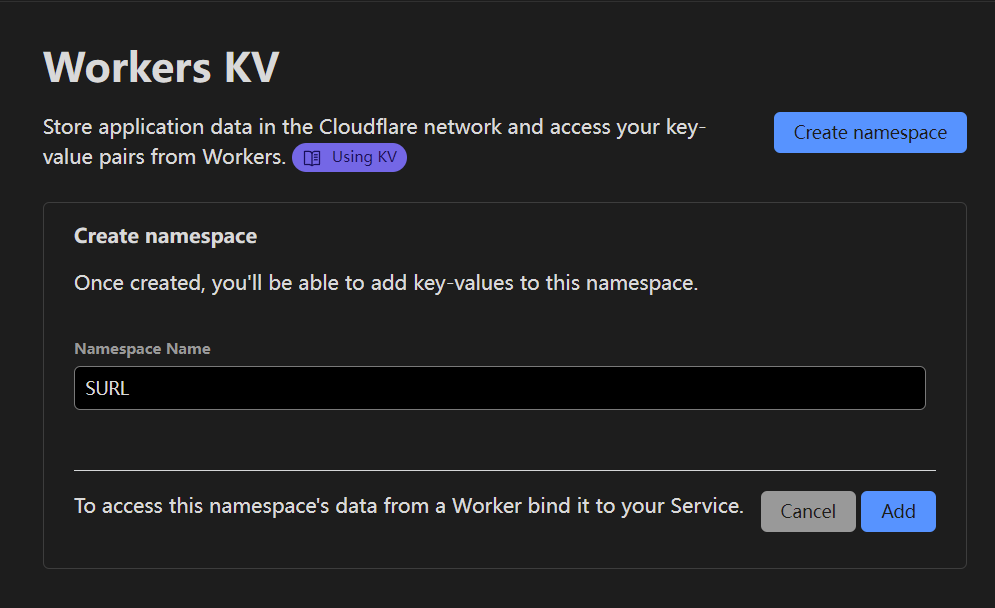
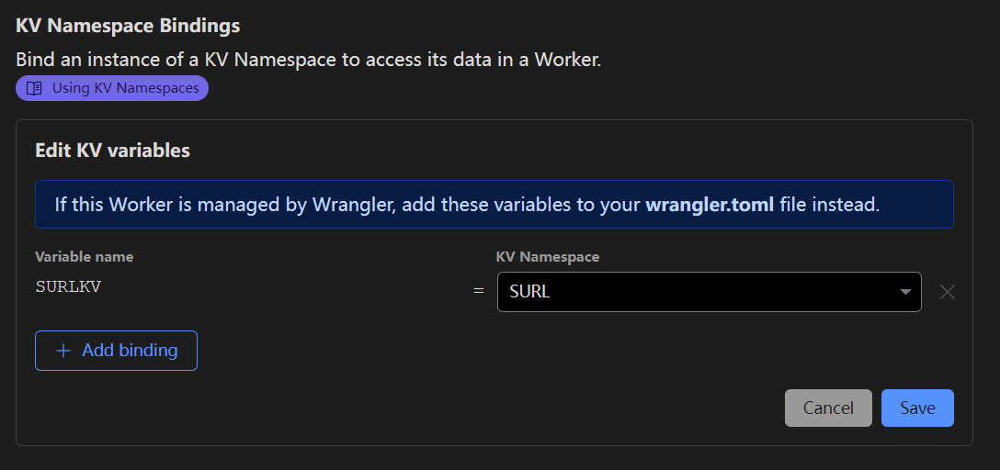
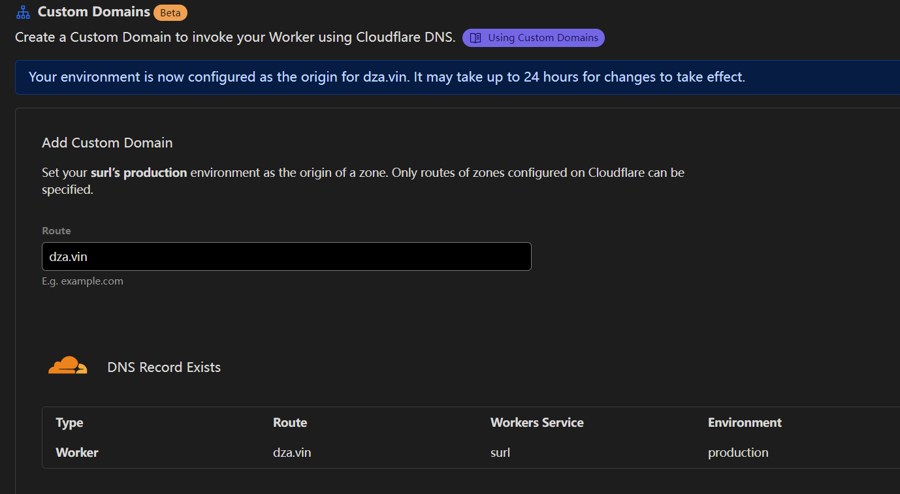

# Deploy

1. Create a Service 
2. Copy the `COPY_THIS.js` to your Workers 
3. Add environment variable `SEED:number` `TotpKey:string` 
   TotpKey suggest 
4. Create namespace
5. KV Namespace Bindings
6. Custom Domains
